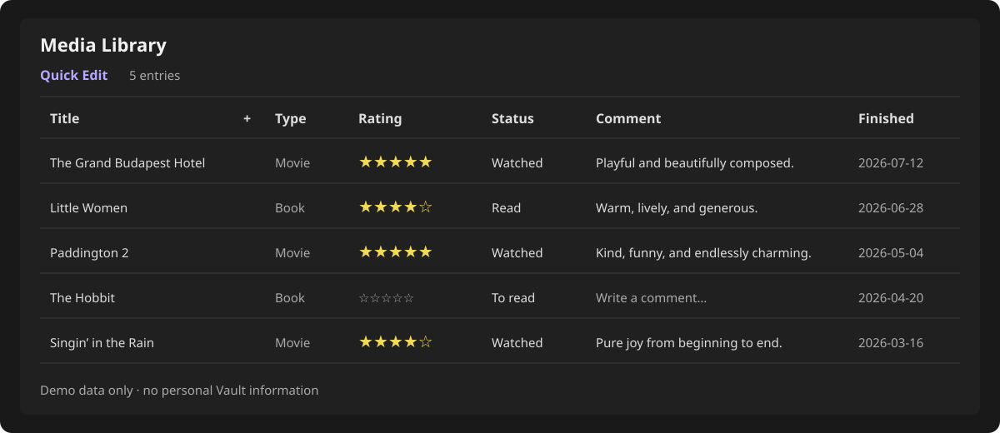

# Media Quick Edit

Media Quick Edit is an Obsidian plugin that turns an Obsidian Bases view into an editable media library. It supports ratings, two-state reading/watching status, auto-saved comments, status history, TMDB movie/TV search, and Open Library book search.



## Requirements

- Obsidian 1.10.2 or newer.
- Obsidian Bases enabled.
- A TMDB v3 API key for movie and TV search.
- Open Library book search does not require a key.

## Installation

### Manual installation

1. Download `main.js`, `manifest.json`, and `styles.css` from a GitHub Release.
2. Create `<vault>/.obsidian/plugins/media-quick-edit/`.
3. Copy the three files into that directory.
4. Restart Obsidian, then enable **Media Quick Edit** under **Settings → Community plugins**.

### BRAT

After a GitHub repository is published, add its repository URL in BRAT and install the latest release. BRAT installation requires the repository releases to include `main.js`, `manifest.json`, and `styles.css`.

## Initial setup

Open **Settings → Community plugins → Media Quick Edit** and configure:

- **TMDB API Key**: stored only in this Vault's local plugin `data.json`.
- **Movie / TV folder**: destination for TMDB entries.
- **Book folder**: destination for Open Library entries.
- **Default Base**: opened by the ribbon shortcut.
- **Automatically open new entry**.
- **Default add type**: movie/TV or book.
- Movie and book status labels.

To obtain a TMDB v3 API key, create a TMDB account, open the API section of the account settings, complete TMDB's API application, and copy the **API Key (v3 auth)** value into the plugin setting. Then use **Test connection** before searching. The key is sent only to TMDB when making TMDB requests and is not required for Open Library searches.

The folder and Base settings include Vault-local pickers. No personal Vault paths are compiled into the plugin.

### Create a compatible Base

1. Create a new Base in Obsidian and enable the **Media Quick Edit** view from the view-type menu.
2. Add Base filters for Markdown files in the configured movie/TV and book folders. With the default settings, use `Media DB/movies` and `Media DB/books`.
3. Select that `.base` file as **Default Base** in the plugin settings.

The plugin does not guess which Base represents your library. This explicit selection prevents it from opening or editing an unrelated Base. The custom view still respects the filters of the Base in which it is used.

## Adding entries

Click the `+` button in the **Title** column header.

- Choose **Movie / TV** to search TMDB.
- Choose **Book** to search Open Library.
- Select a result and its initial planned/completed status.
- The note is created in the configured folder and is picked up by any Base whose filters include that folder.

Open Library results show title, author, and first publication year. Entries without a cover use a local SVG placeholder.

## Editing entries

- Five stars write scores `2, 4, 6, 8, 10`.
- Rating an entry marks it completed and updates `finished_date`.
- Status has two internal values: `planned` and `completed`.
- Status labels are configurable separately for movies and books.
- Comments save automatically; adding a comment marks the entry completed.
- Column widths and sorting are saved in the Base view configuration.
- Unrated entries always sort after rated entries.
- Entries sharing the same completion date use file modification time as the secondary sort key.

## Status history

Actions that overwrite `finished_date` are appended to `status_history`:

```yaml
status_history:
  - 2026-07-25 | 想看
  - 2026-07-26 | 评分：8分
```

The plugin migrates media notes in the configured folders to schema 2:

- `completed` remains `completed`.
- `in-progress`, `on-hold`, `dropped`, missing, and unknown statuses become `planned`.
- Missing `status_history` is initialized as an Obsidian-compatible list of text values.
- `mediaQuickEditSchema: 2` prevents repeated migration.

Back up the Vault before enabling a new plugin version that performs a schema migration.

## Privacy

- The plugin has no developer-operated server.
- Settings, including the TMDB API key, stay in the Vault-local plugin `data.json`.
- `data.json` is excluded by `.gitignore` and must never be committed.
- Movie and TV search terms are sent directly to TMDB.
- Book search terms are sent directly to Open Library.
- Poster and cover images are loaded from TMDB or Open Library URLs unless the user downloads them separately.

## Data sources and attribution

Movie and TV metadata is provided by [The Movie Database (TMDB)](https://www.themoviedb.org/). This product uses the TMDB API but is not endorsed or certified by TMDB. Users are responsible for complying with the current TMDB API terms and attribution requirements.

Book metadata and covers are provided by [Open Library](https://openlibrary.org/), a project of the Internet Archive. Open Library content and API availability are governed by their respective terms and policies.

Media Quick Edit does not own or redistribute the metadata returned by these services.

## Troubleshooting

### The ribbon button cannot find my Base

Choose a valid `.base` file in the plugin settings. If no Base is configured, the plugin uses the currently active Base when possible.

### New entries do not appear in the Base

Make sure the Base filters include the configured movie/TV and book folders. Reopen the Base after changing its filters.

### A large Vault initially shows zero entries

Obsidian Bases performs an initial Vault-wide scan before delivering filtered results to custom views. A Vault containing many generated files or dependency folders can therefore show zero entries for a while on first open. Wait for the scan to finish; if appropriate, add generated or archive folders to Obsidian's excluded-files settings so Bases does not repeatedly index them.

### TMDB search fails

Use the **Test connection** button in settings. Check the v3 API key and network connection.

### Open Library search times out

Open Library requires direct network access. Retry later or check whether `openlibrary.org` is reachable from the current network.

### A view still shows an old plugin version

Disable and re-enable Media Quick Edit, then reopen the Base.

## Development

```bash
npm install
npm run typecheck
npm test
npm run build
```

Run the complete local verification pipeline with `npm run check`. The automated tests cover empty-Vault startup, portable English and Chinese paths, legacy-status migration, missing TMDB keys, Open Library timeouts, and history updates.

Development watch mode:

```bash
npm run dev
```

Prepare local release files:

```bash
npm run release:prepare
```

This creates `release/<version>/main.js`, `manifest.json`, and `styles.css` without uploading anything.

## License

[MIT](LICENSE)

## Author

FlyingNeko
